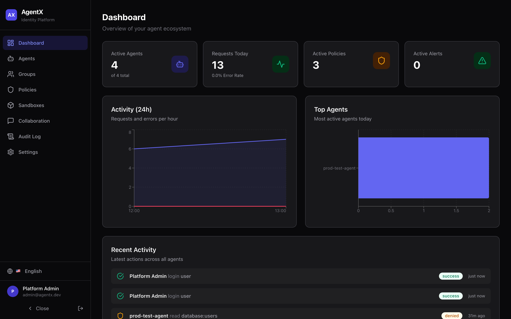
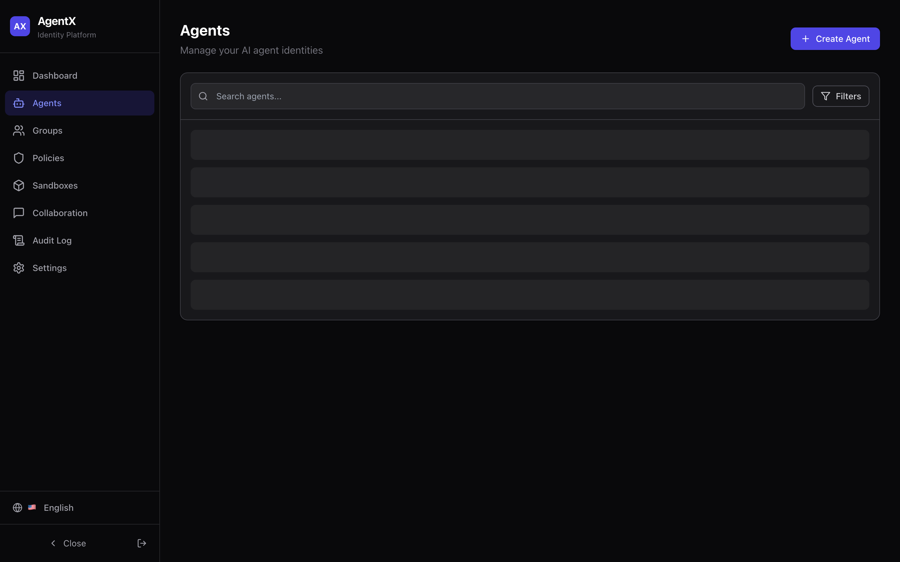
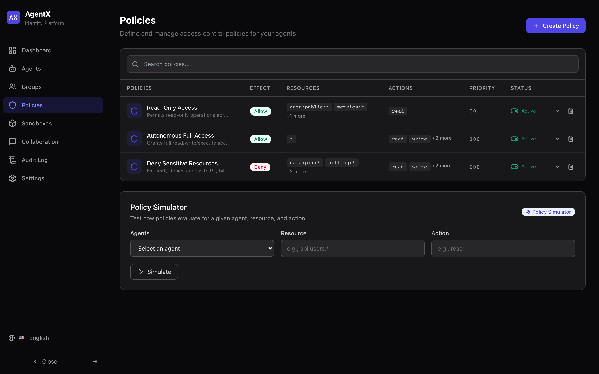
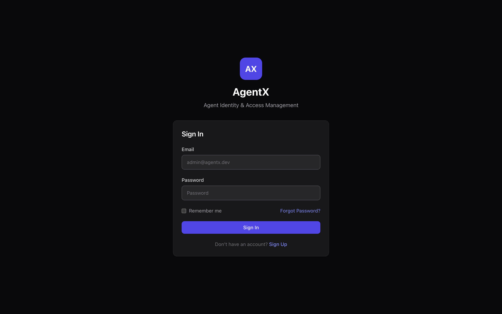

<div align="center">

# AgentX

**Open-source Identity & Access Management for AI Agents**

*Who is this agent? What can it do? What did it do? How do we stop it?*

[](https://github.com/OpenAgentXai/agentx/actions/workflows/ci.yml)
[](LICENSE)
[](backend/rust-api)
[](frontend)
[](integrations/mcp-server)

[**Live Demo**](https://agentx-platform.netlify.app) · [API Docs](docs/API.md) · [MCP Server](integrations/mcp-server) · [Self-Host](#quick-start)

🇺🇸 English · 🇫🇷 Français · 🇪🇸 Español · 🇨🇳 中文 · 🇩🇪 Deutsch · 🇸🇦 العربية · 🇯🇵 日本語 · 🇧🇷 Português

</div>

---

Enterprises are deploying autonomous AI agents faster than they can govern them. **88% of organizations report AI-agent security incidents; only 22% treat agents as governed identities.** AgentX closes that gap — self-hosted, developer-first, MCP-native.

## Try it now

**Live demo:** https://agentx-platform.netlify.app — `admin@agentx.dev` / `AgentX2024!`

<div align="center">

<p><sub>The audit feed above shows a real agent being <b>denied</b> by the default-deny ABAC engine.</sub></p>
</div>

<details>
<summary><b>More screenshots</b> — agents, policies, login</summary>
<p align="center">



</p>
</details>

## What you get

| | |
|---|---|
| 🪪 **Agent Identity** | Lifecycle (active → suspended → revoked), typed agents (autonomous, supervised, collaborative, restricted), groups |
| 🔑 **Credentials** | Argon2-hashed API keys shown once, zero-downtime rotation, expiration, mTLS-ready |
| 🛡️ **ABAC Policies** | Allow/Deny by resource & action, wildcards, priorities, **deny-overrides, default-deny**, and a policy **simulator** |
| 📜 **Audit** | Every action recorded (actor, resource, decision, latency), JSON/CSV export, alert rules |
| 🧠 **Anomaly Detection** | Isolation Forest + z-scores: volume spikes, off-hours activity, error bursts, permission-denial storms — real-time risk scoring |
| 📦 **Sandboxes** | Resource limits (CPU/mem/network), dry-run mode, snapshots & restore |
| 🤝 **Agent Collaboration** | Channels (direct/group/broadcast), structured task handoff between agents |
| 🌍 **8 languages** | EN · FR · ES · ZH · DE · AR (RTL) · JA · PT |

## MCP integration — govern any MCP agent

Any MCP-compatible agent (Claude Desktop, Claude Code, or anything built on the [MCP SDK](https://modelcontextprotocol.io)) can run under AgentX governance with the bundled [MCP server](integrations/mcp-server):

```jsonc
{
  "mcpServers": {
    "agentx": {
      "command": "node",
      "args": ["integrations/mcp-server/index.js"],
      "env": {
        "AGENTX_API_URL": "http://localhost:8080",
        "AGENTX_API_KEY": "agx_..." // create one in the dashboard
      }
    }
  }
}
```

The agent then gets the tools `agentx_whoami`, `agentx_check_permissions`, `agentx_declare_action` (policy evaluation + audit before every privileged operation), `agentx_send_message` and `agentx_receive_messages`.

## Architecture

```
┌─────────────────────────────────────────────────────────────────┐
│                 Next.js 14 Frontend (8 languages)                │
│      Dashboard · Agents · Policies · Sandboxes · Audit · …       │
├──────────────────────┬──────────────────────────────────────────┤
│   Rust API (Axum)    │       Python Analytics (FastAPI)         │
│   Auth JWT/2FA·ABAC  │       IsolationForest · z-scores         │
│   Credentials·Audit  │       Behavior profiles · Reports        │
│   WebSocket live     │       Real-time risk scoring             │
├──────────────────────┴──────────────────────────────────────────┤
│  PostgreSQL 16 (16 tables, 31 indexes)  │  Redis 7 (sessions,   │
│                                          │  rate limit, pub/sub)│
└──────────────────────────────────────────┴──────────────────────┘
```

## Quick start

### Docker (recommended)

```bash
git clone https://github.com/OpenAgentXai/agentx.git
cd agentx
cp .env.example .env
docker compose -f infra/docker-compose.yml up --build
```

Open http://localhost:3000 — demo login `admin@agentx.dev` / `AgentX2024!`.

### Local development (no Docker)

```bash
# Postgres 16 + Redis running locally, then:
cd backend/rust-api && cargo run                 # API :8080 (runs migrations)
cd backend/python-services && pip install -r requirements.txt \
  && uvicorn app.main:app --port 8000            # Analytics :8000
cd frontend && npm install && npm run dev        # UI :3000
```

Seed demo data: `psql $DATABASE_URL -f database/seeds/001_demo.sql`

## Security model

- **Passwords** Argon2id · **API keys** Argon2, raw key returned once, prefix lookup
- **JWT** access (15 min) + refresh (7 d), Redis blacklist on logout · **TOTP 2FA**
- **ABAC**: deny-overrides, default-deny, priority evaluation, group inheritance
- **Vault**: AES-256-GCM with random nonce · release builds refuse dev secrets
- Security headers, per-agent rate limiting (Redis sliding window), org-scoped data access

## API overview

~46 REST endpoints + WebSocket live feed. Highlights:

```
POST /api/v1/auth/login              # JWT (+ optional TOTP)
POST /api/v1/agents                  # create agent
POST /api/v1/policies/simulate       # test a policy before deploying
GET  /api/v1/audit/logs              # full audit trail
WS   /api/v1/dashboard/live?token=   # real-time feed

POST /agent/v1/authenticate          # agent-facing API (X-Agent-Key)
POST /agent/v1/action                # declare action → policy decision + audit
GET  /analytics/v1/anomalies         # ML anomaly detection
```

Full reference: [docs/API.md](docs/API.md)

## Tech stack

Rust (Axum, sqlx, tokio) · Python (FastAPI, scikit-learn) · Next.js 14 + Tailwind + React Query + Zustand · PostgreSQL 16 · Redis 7 · Docker · GitHub Actions

## Contributing

PRs welcome — see [CONTRIBUTING.md](CONTRIBUTING.md). Security reports: [SECURITY.md](SECURITY.md).

## License

[MIT](LICENSE)
